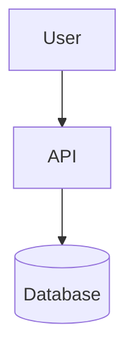
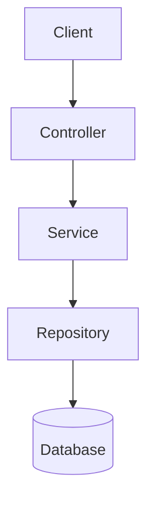

# Jhon Moreno

Software Developer focused on software analysis, backend development and databases.

## About Me

Software Analysis and Development student with hands-on experience building backend systems and designing databases. I prioritize clean code, structured solutions, and following best practices in software architecture.

## Technologies

**Languages:** Java, Python, JavaScript, PHP

**Database:** MySQL, Database Design, Query Optimization

**Tools:** Git, GitHub, VS Code

**Concepts:** Clean Architecture, Layered Design, Separation of Concerns

## Featured Projects

**Academic Projects:**
- Backend systems with layered architecture
- Database design and normalization exercises
- RESTful API development

**Personal Projects:**
- Modular backend applications
- Data modeling and optimization
- Code refactoring and clean code practices

## Architecture Principles

**Layered Architecture:** Clear separation between presentation, business logic, and data access layers

**Separation of Concerns:** Each component has a single, well-defined responsibility

**Modular Structure:** Independent, reusable components that can be tested in isolation

## Database Design Approach

**Normalized Relational Model:** Structured data with minimal redundancy

**Foreign Key Constraints:** Data integrity through proper relationships

**Index Optimization:** Performance improvement for frequent queries

## System Flow

### Detailed System Architecture

### Flow Explanation

**Controller Layer:** Handles HTTP requests and responses, validates input

**Service Layer:** Contains business logic, coordinates operations

**Repository Layer:** Manages data access, executes queries

**Database Layer:** Persistent storage with proper indexing and constraints

## GitHub Activity

## Current Focus

- Deepening knowledge in backend architecture patterns
- Improving database optimization techniques
- Learning advanced Git workflows
- Exploring cloud deployment strategies

## Contact

**Email:** morenopossojhonanderson313@gmail.com

**GitHub:** [Jhonmoreno000](https://github.com/Jhonmoreno000)

---

Open to collaboration on backend projects and learning opportunities.
