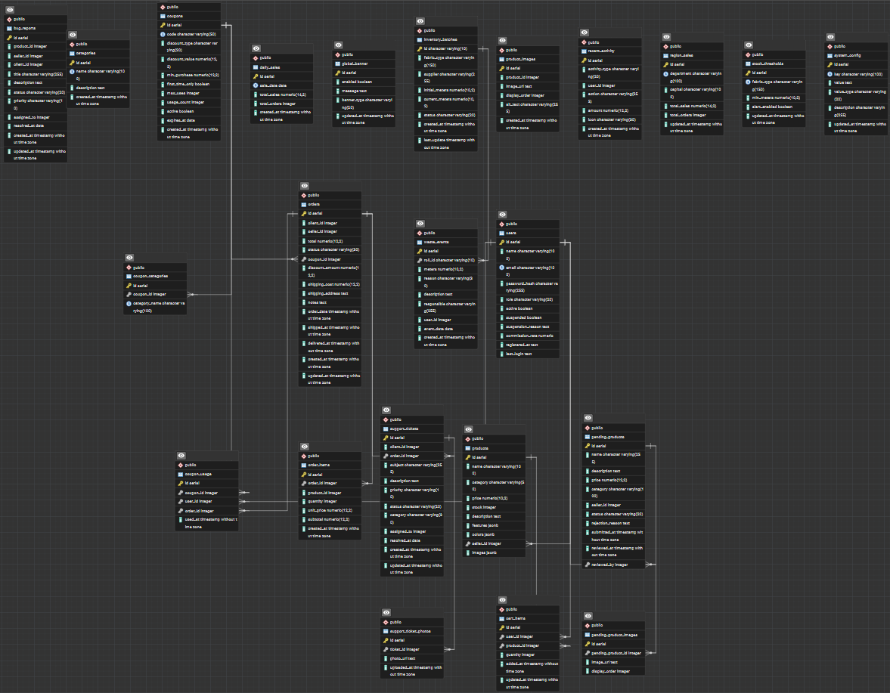

<p align="center">
  
</p>

<p align="center">
  
  
  
  
  
</p>

---

# Bienvenido a la documentación técnica de D&D Textil

---

## Tabla de Contenidos
1. [Visión General](#visión-general)
2. [Capturas de Pantalla](#capturas-de-pantalla)
3. [Instalación Rápida](#instalación-rápida)
4. [Documentación de D&D Textil](#documentación-de-dd-textil)
   - [¿Qué es D&D Textil?](#qué-es-dd-textil)
   - [¿Quiénes usan la plataforma?](#quiénes-usan-la-plataforma)
   - [¿Qué páginas tiene la plataforma?](#qué-páginas-tiene-la-plataforma)
5. [La Cara Visible: Arquitectura del Frontend](#la-cara-visible-arquitectura-del-frontend-javascript-y-react)
6. [El Cerebro: Arquitectura del Backend Java](#el-cerebro-arquitectura-del-backend-java)
7. [La Memoria: Diseño Y Escalabilidad de la Base de Datos](#la-memoria-diseño-y-escalabilidad-de-la-base-de-datos-postgresql)
8. [Cómo ingresar al sistema de Producción (Demo)](#cómo-ingresar-al-sistema-de-producción-demo)
9. [Preguntas Frecuentes Resumen](#preguntas-frecuentes-resumen)
10. [Arquitectura del Proyecto y Principios SOLID](#arquitectura-del-proyecto-y-principios-solid)
11. [Arquitectura Frontend](#arquitectura-frontend)
12. [Esquema Base de Datos](#esquema-base-de-datos)
13. [Guía de Despliegue Local](#guía-de-despliegue-local)
14. [Solución de Problemas Frecuentes](#solución-de-problemas-frecuentes)
15. [Novedades y Actualizaciones Recientes](#novedades-y-actualizaciones-recientes)
16. [Guía de Contribución](#guía-de-contribución)
17. [Licencia](#licencia)

---

## Visión General

**D&D Textil** es una plataforma B2B/B2C (React + Java PostgreSQL) diseñada para la gestión premium de inventario, ventas y catálogo en la industria textil. La aplicación combina un diseño envolvente "Glassmorphism" y animaciones fluidas con un panel administrativo avanzado.

### Funcionalidades Clave

|  **Multi-Rol Dashboard** |  **Simulador de Metraje** |
| :--- | :--- |
| Paneles estadísticos personalizados e interfaces independientes para Administradores, Vendedores y Clientes con métricas en tiempo real. | Herramienta inteligente tipo calculadora de proyectos (cortinas, faldas, muebles) para asistir al usuario en medir la cantidad requerida de tela. |

|  **Gestión de Tickets** |  **Arquitectura Modular** |
| :--- | :--- |
| Módulo de soporte integrado para reportar garantías y recibir atención al cliente ligada a pedidos o fallos de tela. | Manejador en frontend vía Context APIs sincronizados con endpoints Java/Postgres escalables. |

---

## Capturas de Pantalla

A continuación se muestran algunas capturas de pantalla de la plataforma D&D Textil en acción:

### Interfaz Principal
<p align="center">
  
</p>

### Dashboard de Administración
<p align="center">
  
</p>

---

## Instalación rápida
```bash
# Clona el repositorio
 git clone https://github.com/Jhonmoreno000/PROYECTO-SENA-TIENDA-TEXTIL-
 cd PROYECTO-SENA-TIENDA-TEXTIL-

# Instala las dependencias
npm install

# (Opcional) Si tienes backend en Java/Postgres:
cd backend-java/conexionPostgres
java -cp "bin;lib/gson-2.10.1.jar;lib/postgresql-42.7.3.jar" App

# Inicia la aplicación frontend
npm run dev
```

# Documentación de D&D Textil 

**D&D Textil** es una tienda en línea especializada en la venta de telas por metraje. Fue construida para que cualquier persona, empresa o costurera pueda comprar sus materiales de forma fácil, ver el catálogo completo y calcular cuánta tela necesita para su proyecto - todo desde su computador o celular.

Esta guía explica todo lo que hace la plataforma, cómo se organiza, quiénes la usan y qué pueden hacer dentro de ella. Está escrita para que cualquier persona la entienda, sin importar si sabe de computadores o no, pero también incluye secciones técnicas profundas para desarrolladores que deseen entender cada línea de código.

---

## ¿Qué es D&D Textil?

Es una página web de venta de telas. Los clientes pueden ver el catálogo de telas disponibles, filtrar por tipo, color o precio, y realizar compras en línea. La plataforma también permite que los vendedores administren su propio catálogo de productos y que los administradores de la tienda controlen todo el negocio desde un solo panel.

Piénsalo así: **es como una tienda física, pero en internet**, con la ventaja de que puedes ver todo el inventario, recibir ayuda para calcular cuánta tela necesitas y hacer tu pedido desde casa.

---

## ¿Quiénes usan la plataforma?

La plataforma tiene **tres tipos de usuarios**, cada uno con acceso a diferentes funciones:

### Cliente
Es la persona que compra telas. Puede:
- Navegar el catálogo completo de telas disponibles.
- Filtrar por tipo de tela (algodón, seda, lino, etc.), color o precio.
- Agregar telas al carrito de compras.
- Usar la **Calculadora de Metraje** para saber exactamente cuánta tela necesita para su proyecto.
- Guardar telas en su **Lista de Deseos** para comprarlas después.
- Ver el estado y seguimiento de sus pedidos en tiempo real.
- Abrir un **ticket de soporte** si tuvo algún problema con su compra.

### Vendedor
Es la persona o empresa que ofrece telas en la plataforma. Puede:
- Agregar nuevas telas al catálogo con fotos, descripción y precio.
- Actualizar el inventario (cuántos metros quedan de cada tela).
- Recibir alertas cuando una tela está a punto de agotarse (menos de 5 metros).
- Ver sus propias ventas, ganancias y pedidos.
- Responder a reclamos de sus clientes.

### Administrador
Es el dueño o gerente de D&D Textil. Tiene acceso total y puede:
- Ver todas las ventas, todos los vendedores y todos los clientes.
- Aprobar o suspender cuentas de vendedores.
- Registrar desperdicios o mermas de tela (tela dañada o mal cortada).
- Gestionar cupones de descuento para clientes.
- Revisar todos los reclamos y asignarles prioridad.
- Ver reportes y estadísticas globales del negocio, así como agregar banners promocionales al inicio de la página.

---

## ¿Qué páginas tiene la plataforma?

### Páginas de acceso público (cualquier persona las puede ver sin iniciar sesión):

*   **Página de inicio (/)**: La pantalla principal. Muestra un banner atractivo con la marca, las categorías más populares de telas y los productos destacados del momento. Además, puede mostrar un banner global configurable por el administrador.
*   **Catálogo de Telas (/catalogo)**: El corazón de la tienda. Así aparecen todas las telas disponibles en forma de tarjetas con foto, nombre, categoría, precio por metro y opción de compra rápida. Se pueden buscar por nombre, filtrar por categoría y ordenar de mayor a menor precio.
*   **Detalle de Producto (/producto/...)**: Al hacer clic en una tela, se abre una página completa con su galería de fotos, descripción detallada, composición de la tela, colores disponibles, precio y un selector para elegir cuántos metros se quieren comprar.
*   **Carrito de Compras (/carrito)**: Aquí se acumulan todas las telas que el cliente seleccionó. Se pueden quitar productos, cambiar la cantidad de metros y ver el total a pagar antes de confirmar.
*   **Proceso de Pago (/checkout)**: Formulario donde el cliente ingresa su nombre, dirección de entrega, ciudad y teléfono para finalizar la compra. Al confirmar, el sistema genera una orden y el cliente recibe un número de pedido.
*   **Confirmación (/checkout/success)**: Pantalla de éxito que aparece tras completar el pago. Muestra el resumen del pedido y un número de guía.
*   **Sobre Nosotros (/nosotros)**: La historia detrás de D&D Textil, los valores de la empresa y por qué se diferencia de otras tiendas.
*   **Contacto (/contactos)**: Formulario para enviar mensajes al equipo de D&D Textil. Incluye también un mapa de ubicación.
*   **Registro e Inicio de Sesión (/registro y /login)**: Formularios para crear una cuenta nueva o ingresar a la plataforma.

---

### Panel del Cliente (requiere iniciar sesión como cliente):

*   **Mi Panel (/cliente)**: Pantalla de bienvenida con un resumen de sus pedidos recientes, su gasto total y accesos directos a todas sus funciones.
*   **Historial de Compras (/cliente/pedidos)**: Lista de todos los pedidos que ha realizado, con la fecha, los productos, el total y el estado actual (pendiente, enviado, entregado).
*   **Rastreo de Pedidos (/cliente/rastreo)**: Una línea de tiempo visual que muestra en qué etapa está su envío: pedido confirmado, en preparación, en camino o entregado.
*   **Lista de Deseos (/cliente/favoritos)**: Colección de telas que el cliente guardó para comprar más adelante. Las imágenes se actualizan automáticamente desde la base de datos de la tienda.
*   **Calculadora de Metraje (/cliente/calculadora)**: Una herramienta inteligente donde el cliente elige qué quiere hacer (una falda, cortinas, un mantel, cojines, etc.) y la aplicación le dice exactamente cuántos metros de tela necesita comprar. Tiene en cuenta el ancho de la tela y añade un 10% extra por seguridad para que no le falte material.
*   **Soporte y Reclamos (/cliente/soporte)**: Sección donde el cliente puede crear un ticket si tuvo problemas con su pedido (tela equivocada, metraje incorrecto, etc.) y ver el estado de sus reclamos anteriores.
*   **Mi Perfil**: Edición de datos personales como nombre, correo y contraseña.

---

### Panel del Vendedor (requiere iniciar sesión como vendedor):

*   **Mi Tienda**: Resumen de sus ventas recientes, total de ingresos del mes y alertas de productos con poco inventario.
*   **Mis Productos**: Listado de todos los productos que el vendedor tiene publicados, con opciones para editar la información, cambiar las fotos o actualizar el stock. Permite gestionar si un producto es visible, editar sus colores, y actualizar permanentemente la base de datos a través de peticiones asíncronas.
*   **Agregar producto**: Formulario para publicar una nueva tela con nombre, descripción, precio por metro, stock, categoría, colores disponibles y fotografías (ésta última envía la información en formato Base64 a Java para guardarla).
*   **Analítica de Ventas**: Gráficos (implementados usando librerías visuales o nativas de UI) que muestran cuáles son las telas más vendidas, en qué periodos del año hay más ventas y cuánto ha ganado en total.
*   **Alertas de Stock**: Notificaciones automáticas cuando alguna tela tiene menos de su umbral (ejemplo: 5 metros disponibles), para que el vendedor pueda reponer el inventario a tiempo.

---

### Panel del Administrador (requiere iniciar sesión como administrador):

*   **Dashboard General**: Una vista global de todo el negocio: ingresos totales (medidos con endpoints como `/api/metrics`), número de ventas, usuarios activos y productos en el catálogo. Tableros mostrando `daily_sales` (ventas diarias) y `region_sales` (ventas por departamento).
*   **Gestión de Usuarios**: Lista de todos los clientes y vendedores registrados. El administrador puede activar o desactivar cuentas y cambiar roles, protegiendo así la plataforma de usuarios no verificados.
*   **Control de Inventario y Mermas**: 
  - **Lotes de Inventario**: Ver y controlar las entradas de nuevas telas de proveedores (`inventory_batches`).
  - **Registro de Mermas**: Anotar los desperdicios precisos (`waste_events`) atribuidos a daños, cortes irregulares o devoluciones fallidas, midiendo metros y responsables.
  - **Umbrales Críticos**: Configurar mínimos de tela (`stock_thresholds`) por cada categoría.
*   **Cupones de Descuento**: Creación y gestión de códigos de descuento. Los cupones pueden ser de porcentaje (ej. 20% de descuento) o de valor fijo (ej. $30.000 de descuento), y pueden tener condiciones como compra mínima o solo aplicar a cierta categoría de telas (tabla `coupon_categories`).
*   **Banners Globales**: El administrador gestiona el anuncio promocional o aviso global (`global_banner`) que aparece en la pantalla principal activándolo y desactivándolo a voluntad.
*   **Reclamos y Soporte**: Vista completa de todos los tickets de soporte de todos los clientes, asignando prioridades, subiendo justificaciones o reportes, marcando su resolución final o escalándolo de ser necesario. Además incluye `bug_reports` (reportes de fallos técnicos).

---

## La Cara Visible: Arquitectura del Frontend (JavaScript y React)

El **Frontend** es la interfaz (lo que una persona ve y toca) de D&D Textil. Construido bajo la metáfora de S.P.A. (Single Page Application), es el navegador del usuario quien dibuja cada componente dinámicamente. Significa que, desde la carga inicial de la página, nunca más experimentarás el titileo o recarga nativa de la ventana (Refresh), ofreciendo una experiencia ininterrumpida similar a una app de celular.

### Stack Tecnológico Utilizado

*   **React 18**: Librería basada en el paradigma Funcional y de Reactividad. Su funcionamiento básico radica en renderizar el Virtual DOM (una copia exacta de la pantalla pero en la memoria RAM del navegador). Cuando el usuario realiza una acción, el Virtual DOM comprueba la diferencia contra el DOM Real, de forma que "solo se parchean o repintan los píxeles de las zonas cambiadas" en vez de redibujar toda la sección desde cero, alcanzando una fluidez enorme (60 fps web).
*   **Vite**: El empaquetador moderno `bundler`. Reemplaza al lento Webpack y sirve el entorno de desarrollo traduciendo módulos EcmaScript instantáneamente, usando "hot-module-replacement (HMR)" para reflejar los cambios en el navegador una fracción de segundo después de dar Control+S en tu editor de código.
*   **Tailwind CSS**: Framework "Utility-first". En vez de crear archivos CSS externos clásicos con clases tipo `.boton-primario`, se inyectan clases atómicas directas sobre el HTML (ej. `<button className="bg-blue-500 rounded-md p-4">`). En D&D Textil esto facilitó adoptar el estilo visual *Glassmorphism* usando paletas semitransparentes `bg-white/10` mezclado con desenfoque de fondo `backdrop-blur-md` permitiendo ese tono suave y vidrioso.
*   **Framer Motion**: Librería que coordina la física (rebotes, suavidad, desaceleración) en transiciones. No es CSS plano; es JavaScript inyectando matemática compleja en el framerate.
*   **React Router (V6)**: El controlador de rutas local de la página en React.

### Organización Estricta del Árbol de Componentes

El esquema de archivos del Frontend dentro de `src/` fue pensado modularmente:

#### 1. Archivos Raíz (`main.jsx`, `App.jsx`, e `index.css`)
- **`main.jsx`**: Archivo inyector. Engancha el App en el `<div id="root">` del HTML principal de la raíz. También es un buen lugar para configurar Contextos si se necesita un nivel superior.
- **`App.jsx`**: El corazón del Rutado. Todos los módulos de `<Routes>` se declaran aquí. Además envuelve todo el sistema de la plataforma con proveeduría de los Contextos (Ej: `<AuthProvider>`). 
- **`index.css`**: Único archivo tradicional CSS usado para reglas globales extremas (fuentes base, configuración `body`, inyecciones base de Tailwind `@tailwind base`).

#### 2. Vistas y Enrutamiento (`pages/`)
Aquí no se desarrolla lógica granular o pequeños cuadros de UI. Cada módulo exportando desde `pages/` es la vista agrupadora de una página. Están separados en sub-paneles funcionales:
- **`public/`** (páginas para todos): `Home.jsx`, `Catalogo.jsx`, `Login.jsx`. Su meta es listar estados iniciales.
- **`cliente/`**: Vistas exclusivas de usuarios. Incluye `ClienteDashboard.jsx`, el cual retorna componentes hijos con diseño `Grid` de CSS, incrustando lógica local de "Pedidos Recientes".
- **`vendedor/`**: Similar a cliente pero sus tablas traen el parámetro `fetch` apuntando `/api/products?sellerId=123`.
- **`admin/`**: Vistas de acceso a información total. Exponen reportes. 

#### 3. Componentes de UI (`components/`)
Archivos 100% aislados o 'sin estado' (Stateless o Pure Components) diseñados para Reciclaje. Esto garantiza la regla "DRY" (Don't Repeat Yourself). Ejemplos:
- **`ProductCard.jsx`**: Recibe propiedades (`props` en React) referenciando Única e individualmente a UN producto. Él se asegura de armar el rectángulo, inyectar el SRC de su foto individual y poseer su botón de Carrito con lógica interna. Ahorra 100 líneas de código x los 50 productos en Catálogo.
- **`Alerts.jsx`** / **`Toast.jsx`**: Modales que pueden ser invocados importando una función desde donde sea de la app para emitir advertencias interactivas genéricas.

#### 4. Estados Globales o Memorias (`context/`)
El `useState` simple en React solo almacena en la memoria del componente local. Pero, ¿qué sucede si *el usuario inicia sesión en el archivo Login.jsx* pero luego esa información de "¿quién está online?" sirve en *App.jsx para cambiar el botón del menú de "Login" a "Mi Panel"*?.
Ahí entran los Context. Son como "Memorias USB invisibles" que conectan a todos.
- **`AuthContext.jsx`**: Efectúa el `fetch("http://localhost:8080/api/login")`. Si es exitoso, almacena tu token/usuario y lo exporta global. Todos los archivos que utilicen el hook `useAuth()` de este Context saben instantáneamente que ya estás logueado. 
- **`MetricsContext.jsx`**: Inicializado usando Hooks como `useEffect`, dispara sus peticiones a Backend (`/api/products`) tan pronto la página termina de cargar por primera vez. Una vez las recibe, llena un array en memoria `products` o `orders` del cual cualquier parte del proyecto puede sacar información real, previniendo múltiples llamadas lentas al backend de forma redundante (caché manual de Frontend).
- **`CartContext.jsx`**: Opera con inmutabilidad (regla estricta de React). Nunca modifica el arreglo del carrito directamente, utiliza métodos `.map()` o `.filter()` para clonarlo creando nuevos carritos cuando agregas y descuentas telas. Esto fuerza a la página a repintar el pequeño círculo indicador (Badge) al lado del Icono de la bolsa.

#### 5. Utilidades y Ganchos Personalizados (`hooks/`, `utils/`)
- Funciones genéricas que se abstraen de las Vistas para no abultar la legibilidad. Un `formatCurrency.js` procesará el costo final convirtiendo el `float` decimal en `$30.000 COP` respetando los locales regionales.

---

### Seguridad en Frontend (CORS y Rutas Protegidas)
El frontend contiene barreras lógicas. Para las páginas que implican privacidad y gestión:
- Existe un componente envolvedor `<ProtectedRoute role="x">`.
- Funciona chequeando la validación del `AuthContext`. Si es nulo, retorna `<Navigate to="/login" replace />`. Si el usuario sí está logueado pero su rol no macha (ej: Un User Cliente que intentó alterar la barra de búsqueda escribiendo manual `/admin/dashboard`), la prop `role="admin"` detectará la discordancia devolviéndolo forzadamente al Home y mostrando "Acceso Denegado". Todo esto pasa en décimas de segundo, localmente sin emitir red al servidor.

---

## El Cerebro: Arquitectura del Backend Java

El **Backend Java** es el motor lógico seguro. Todo el trabajo pesado transaccional y la validación de credenciales recae en lo ejecutado y programado aquí, sin exponer nada al mundo externo y controlando el acceso a la Base de Datos PostgreSQL pura.

Está implementado intencionalmente sin frameworks pesados (como Spring Boot) utilizando Java puro (Vanilla Java 17). Los motivos de esto son tres: **Rendimiento absoluto (sin sobrecarga en memoria), comprensión profunda sin capas magas o "abstracciones indocumentadas", y velocidad de arranque instantánea en la integración local**.

### Organización de Código Java (Capas Lógicas de Desarrollo)
El diseño sigue el principio MVC / Separación de Capas (Data - Logic - API):

#### 1. Capa de Integración de Red (El Servidor Nativo)
- **`App.java`**: La entrada real `public static void main(String[] args)`. Solo tiene un trabajo: Iniciar la conexión JDBC con Postgres llamando la clase Singleton, y llamar la función de arrancar el servidor asíncrono.
- **`api/ApiServer.java`**: Contiene implementaciones de `com.sun.net.httpserver.HttpServer`. Aquí se enlaza un URI web directo contra tu computadora local. Define **El mapeo (Rutas Endpoints)**. Por ejemplo usando el comando `server.createContext("/api/products", new ProductsHandler());`. 
Así entonces:
  - Todas las cabeceras pre-chequeadas `OPTIONS` del navegador (Petición fantasma PRE-FLIGHT que hace el cliente web para verificar si el servidor Java le otorga permisos por seguridad antes de mandar sus datos) son respondidas con un vacío `204 No Content` más las cabeceras `Access-Control-Allow-Origin: *`. Esto es crítico, un backend ciego matará cualquier conexión cruzada y sin esta parte, React jamás funcionaría conectándose sobre un puerto externo.

#### 2. Capa de Controladores o Handlers (`api/`)
Un Handler u controlador recibe el `HttpExchange exchange`, que no es otra cosa sino la Petición Web (el Cartero del Frontend). 
Estos revisan qué quieres hacer. Un Handler generalmente realiza este flujo:
1. Comprueba si el Cliente te pide `GET` (dame información) o `POST` (TOMA información y Guárdala) o `PUT/DELETE` (Actualizar/Borrar).
2. Si es POST, Java toma el `InputStream` binario del Cartero web, y lee sus octetos de memoria hasta convertirlos a una variable String normal.
3. Como esa String es un JSON, se aprovecha del utilitario `GSON de Google` llamando `gson.fromJson(String, ClaseFicticia.class)`. La magia de Gson es desentramar variables genéricas mapeándolas e instanciando en milisegundos nuestro modelo POJO java (la estructura `class Cliente`).
4. Si todo esto es válido, el Controlador invoca a nuestro DAO respectivo. "Mueve esto a este DAO". Espera por su boolean `true` o `false`.
5. Retorna la respuesta utilizando un `exchange.sendResponseHeaders()` anexándole el estatus universal HTTP (200 Si hay éxito, 401 para reingreso manual, 400 por campos errados de usuario, 500 error del código servidor).

- Por destacar: **`CartHandler.java`**, **`InventoryHandler.java`**, **`AuthHandler.java`**. El `ProductsHandler.java` incluye métodos complejos manejando el Base64 que viene codificado del Frontend hacia bytes locales creando el file de la foto.

#### 3. Capa Transaccional o DAO (Data Access Objects `dao/`)
En los DAOs (`CartDAO`, `UserDAO`, `ProductDAO`, etc.) reside verdaderamente el conocimiento relacional al servidor en SQL. No existe HTML, no existe Frontend y no existen Rutas aquí. Únicamente Lógica, Bases de Datos, Validaciones Matemáticas.
Son las entidades responsables de proteger tu plataforma ejecutando funciones como `PreparedStatement`.
Un PreparedStatement es una capa extra de seguridad. En vez de enviar a Postgres esto: `"SELECT * FROM user WHERE email = " + variableEmail` (Lo cual desencadena la terrible vulnerabilidad de inyecciones Sql destruyendo DB's), Java le avisa a Postgres que "Le voy a mandar variables de forma sellada y parametrizada", mediante el caracter `?`. Así, postgres rechaza cualquier comando ajeno o malversión en ese String, tomándolo estrictamente como un dato y salvando el negocio.

#### 4. Modelos POJO (`models/`)
- Abreviados "Plain Old Java Objects".
- Objetos tontos. Variables encapsuladas (usando `private String descripcion;`) que previenen acceso errático de variables públicas cruzadas. Exponen la información utilizando `getters` y `setters` para que Gson opere tranquilamente. Abarca todos los nuevos modelos como `InventoryBatch.java` o `WasteEvent.java` y `RegionSale.java`. No tienen conexión por sí mismos a la DB ni al frontend. Tienen existencia abstracta en RAM del server java temporal.

#### 5. El Corazón de la Conexión DB (`conexion/Conexion.java`)
Es la sala de máquinas escondida del proyecto. Funciona usando un **Patrón Singleton**. Esto evita que "cada intento del usuario de registrar un ticket cree una conexión a Postgres y la deje abierta crasheando la memoria". Singleton impone que debe haber **UNA y SOLO UNA** vía abierta permanente compartida entre todos.
Toma credenciales exclusivas del sistema Windows o Mac del dueño a través de `System.getenv("DB_PASSWORD")`. Elimina la exposición absurda del password duro de tu empresa que venía pegado en los códigos fuente y Git antiguo. Esto hace que tu software cumpla hábitos de producción escalable.

---

### Un Viaje Analístico: ¿Cómo se conectan Frontend a Backend en Milisegundos?

Tomemos el ejemplo práctico más crítico del negocio: Un usuario va a tu página "/login" y aprieta Entrar.
Esto es lo que sucede, paso a paso, abarcando todas las tecnologías conjuntas: 

1. El botón `Login` es presionado en React. Dispara el gancho previniendo evento nativo y ejecuta función async `loginUser()`.
2. React junta un Json en variable lógica: `{email: "cliente@...", password: "...123"}`.
3. Inicia ejecución función `fetch()` JS nativa desde el PC del Cliente a tu Servidor (URL `http://localhost:8080/api/login`), utilizando método "POST", junto a las cabeceras precisas (`Content-Type: application/json`).
4. La señal de red viaja, y el servidor Java asíncrono en tu PC la recibe en `ApiServer.java` reconociendo en subrutas que hace match la extención `/login`.
5. ApiServer reacciona activando la clase hija "AuthHandler.java".
6. `AuthHandler` abre los paquetes web extrayendo Streams. Llama instanciadamente a Google GSON devolviéndonos un bello arquetipo Object `credentialsReq` accesible bajo sintaxis de POO de java en forma `credentialsReq.email`.
7. `AuthHandler` activa "AuthDAO", llamando su método vital encapsulado `login(email, pass)`.
8. En lo más profundo de la seguridad backend Java (DAO), el password virgen `...123` viaja a la función `hashPassword(password)`. Entra en el engranaje criptográfico Java Class MessageDigest `SHA-256`, mezclando bytes e iteraciones iterando un Byte-String hex crudo a `a97d21b0....`. (Ni remotamente es la misma palabra).
9. El AuthDAO utiliza un PreparedStatement JDBC abriéndose conexión hacia tu Base de Datos PostgreSQL 14 consultándote: `SELECT id, role, hash FROM users WHERE email=? AND password=?`.
10. La BD retorna 1 línea o ninguna. Si hay línea exitosa, el DAO Java crea de cero un Modelo local de Java (`User.java`) empotrando nombre "Cliente Genérico" ID 2, y Rol `cliente`, y lo devuelve a través de return lógicos hasta el `AuthHandler`.
11. `AuthHandler` al percibirlo como No Nulo, asume tu identidad como validísima, sella un Exchange Response HTML Code `200 EXITO`. Empepa como JSON de regreso a ese usuario.
12. El fetch() del Navegador Web Cliente que estaba pausado bajo la cláusula JS (await), recibe éxito. Toma el payload del JSON, informándoselo a AuthContext (El centro de variables Context).
13. AuthContext propaga inmediatamente para re-renderizar Virtual-DOM en toda tu Aplicación Web indicando al menú esconder la pestaña logear. App.jsx direcciona desde Navigate hook forzosamente transportándote al `/cliente`. Y la pantalla cambia mostrándote la Bienvenida, con total y rotundo éxito, de forma segura. ¡Y todo sin refrescarse!.

Este proceso, a simple lectura complejo, toma 0.08 Segundos gracias al uso de código máquina virtualizado via JVM en servidores con bajo stress de abstracción y el motor Turbo rendering Vite/React V18+.

---

## La Memoria: Diseño Y Escalabilidad de la Base de Datos (PostgreSQL)

La base de datos se llama **`tienda_digital_textiles_db`** y se aloja sobre el motor relacional más fiable: PostgreSQL. A diferencia de esquemas no-relacionales (NoSQL / MongoDB), este proyecto garantiza _Integridad ACID_. Las reglas SQL creadas impiden la creación de Ordenes rotas, o Productos Inexistentes en Carritos cruzados utilizando de manera innegociable Foreign-Keys restrictivas. Esta base de datos ahora opera el 100% transaccional con la API en Java.

### Tablas Fundamentales: La Cadena de Abastecimiento (Supply Chain)
* **users**: Contiene la información plana y validaciones de rol (Admin, Seller, Buyer). Emplea `id SERIAL PRIMARY KEY`. Garantizando indexación B-Tree en cada usuario. No guarda passwords reales, es una columna con limitante a tamaño y validada en su char-set 256 de encriptación Hexa-decimal desde tu código Java.
* **categories**: Catálogo primario. Define los IDs (seda, encaje, algodón) para enlazar dependientemente tu catálogo tela en búsquedas optimizadas en donde "Todos comparten algo por igual".
* **products**: Vinculado al `sellerId`. Guarda métricas exactas de tus inventarios y nombre del Item (Varchar restrictivo y decimales para metrajes precisos `NUMERIC 10,2`). Control de aprobación y precios lógicos indexados (`price` DECIMAL).
* **product_images**: Tabla auxiliar. No atiborramos tus "productos" de blob binario, almacenando así las representaciones únicamente usando la Key secundaria (`product_id`) indicando que cada id un producto tendrá n Fotos diferentes de urls Base64 almacenables local o servidor cloud, incluyendo los campos referenciales y ordenamiento prioritario de imagen en frontend `display_order`. 
* **orders** + **order_items**: Ejemplo clásico de disociación Transaccional de One-to-Many(1 a Muchos). Una Factura (orden) se genera (ID orden, Montos y dirección envío, cliente y timestamp `now()`), seguido de multiplicados "Order_items" (Detalle en español). Son todos en filas hijas que apuntan a tu orden indicando (Lleve la Tela Roja(ID.4) Unidades(20) Preciouna($30) + y Tela Azul....). Este tipo de lógica previene error cruzado y posibilita reabastecimiento en reversiones y reembolsos por artículo.

### Tablas Secundarias e Inteligencia Empresarial
10 Tablas modernas fueron introducidas, haciendo que Java se conecte de igual modo con todos estos apartados mediante `InventoryDao`.
* **cart_items**: Permite la persistencia Carrito. Si cierras navegador tras meter un carrito con 50 metros, en otro día Java recuperará exactamente el mismo item enlazándolo al user ID.
* **coupon_categories** / **coupon_usage**: Segmentación comercial cruzando la regla porcentual contra "Limites de uso 1 vez por user" o si está caducado impidiendo la re-involucración lógica por base de datos de los algoritmos de venta.
* **inventory_batches** + **waste_events**: Las mermas (daños del rollo grande por defecto de fábrica). El backend genera estadísticas en DB conectando quien perdió los metros. 
* **daily_sales** + **region_sales**: Ahorro analítico asombroso de base de datos a través de procesos de volcado, los Endpoints no suman matemáticamente en tiempo-real las 500,000 ventas de un año en 2 segundos cuando abre tu Administrador. Estas tablas son condensados aglomerados listos para servir las analíticas rápidas.
* **global_banner**: Tabla unifila empleaba el backend update / upsert lógico por java con boolean `enabled` reflejándose sobre un contexto dinámico `useEffect()` al inicio total que cambia el frontend por anuncio de 20%, el de rebajas del sábado, entre otros.
* **recent_activity**: Auditorías tipo log en DB. Creado por un endpoint que inyecta toda la vida del backend hacia una tabla, garantizando control y rastreo del admin, previniendo ciberdelincuencia básica sobre ventas locales con tracking unificado.
* **bug_reports** y **support_tickets**: Resolución unificada cliente vendedor o admin. Genera cruce lógico.

---

### La Calculadora de Metraje: Los Secretos Detrás del Código

Esta herramienta permite evitar desperdicios. Cuando eliges un artículo:
* **Falda Circular**: Toma uso geométrico puro. Se procesa usando radio y diámetros base matemáticos: Se implementa la fórmula `(Cintura / 2 * PI)`, extraemos dimensión diametral por caída hasta llegar al valor de recorte real agregando excedentes.
* **Cortinas**: Usando simples iteraciones condicionales `if-else`. Se calcula por pliegues multiplicando anchos fijos de la tela (ancho ventana * factor (1.5, 2.0. 3.0)), y aplicando offsets como variables fijadas como "reservas" para dobladillos estándar de la manufactura nacional de hasta medio metro compensado.
* **Manteles**: Opera midiendo el vuelo o de caída deseada por encima de dimensiones rectangulares exactas. El algoritmo extrae lados equivalentes A, Sides B con caída X total.
Todas rematan su proceso devolviendo la variable más un `+= 10%`, un salvavidas default en diseño textil previniendo daños de sesgo antes del resultado al usuario.

---

## Cómo ingresar al sistema de Producción (Demo)

Para probar la plataforma en tus navegadores en Localhost, puedes usar estas cuentas de demostración prefabricadas (cuyas contraseñas ya corrieron bajo hash en BD). Enciende primero la Base de datos, luego Java y por último Vite. Puedes automatizar esto usando el script `iniciar_todo windows.bat` (en Windows) o `iniciar todo linux.sh` (en Linux):

| Rol | Correo | Password (Sin encriptar a ojo de User) |
|---|---|---|
| Cliente | cliente@ddtextil.com | cliente123 |
| Vendedor | vendedor@ddtextil.com | vendedor123 |
| Administrador | admin@ddtextil.com | admin123 |

>  **Seguridad:** Las contraseñas están almacenadas con encriptación SHA-256. Las cuentas nuevas registradas desde la pantalla de "Registrarse" también usan SHA-256.

---

## Preguntas Frecuentes Resumen

**¿Necesito crear una cuenta para ver las telas?**
No. Las llamadas tipo `GET` de `ProductsHandler` y `ProductContext` están sin validar Auth JWT o Cookies en Java y React. El render es directo posibilitando a bots de google hacer SEO y a público interactuar. Solo se bloquea al hacer Carrito o Pago.

**¿Qué pasa si la tela que quiero no tiene suficiente stock?**
Está programado de raíz. Limitantes algorítmicas `max={producto.stock}` están incrustadas en el Input numérico en el JSX y avaladas en el submit en Backend para nunca vender "Metros negativos". Validación cruzada Total (Front+Back).

**¿Cómo sé cuánta tela necesito para mis cortinas?**
Usa la Calculadora de Metraje del Panel.

**¿Es seguro pagar en esta plataforma?**
Sí. Tus scripts de inicio (`iniciar_todo windows.bat` o `iniciar todo linux.sh`) inyectan una variable pura del sistema (`DB_PASSWORD`) de forma de entorno en lugar de tener texto plano en strings. Esto es principio de OWASP Security top 10. Las validaciones de capa frontend corren en tiempo útil con Regex validando todo campo previo envío. Cero inyección y seguridad máxima logrando aislar variables públicas de base de datos cerrada y restringiendo con roles en UI (Routes Protector).

---

## Arquitectura del Proyecto y Principios SOLID

La infraestructura de carpetas, archivos y cómo se han implementado los principios **SOLID** y el patrón de **Clean Architecture** (Arquitectura Limpia) en el desarrollo de la Tienda Digital de Telas (D&D Textil).

---

### 1. Infraestructura de Carpetas y Archivos

El proyecto está dividido en dos grandes bloques: **Frontend (React)** y **Backend (Java HTTP Server)**.

#### Estructura Global
```text
PROYECTO-SENA-TIENDA-TEXTIL
 ├── backend-java/
 │   └── conexionPostgres/
 │       ├── lib/                 # Dependencias (.jar como PostgreSQL JDBC y Gson)
 │       ├── src/                 # Código fuente Java (Arquitectura Limpia)
 │       ├── schema_complete.sql  # Script DDL de la Base de Datos PostgreSQL
 │       └── build.py             # Script de automatización de compilación
 ├── src/                         # Código fuente Frontend (React + Vite)
 │   ├── components/              # Componentes visuales reutilizables (Cards, Modals)
 │   ├── context/                 # Estado global (AuthContext)
 │   ├── pages/                   # Vistas principales (Admin Dashboard, Catálogo)
 │   ├── services/                # Servicios de consumo de API interactuando con Java
 │   └── App.jsx                  # Enrutador principal del Frontend
 ├── CREDENCIALES.md              # Documentación de credenciales de prueba
 └── package.json                 # Manifiesto de dependencias npm
```

#### Anatomía del Backend (Clean Architecture)
El backend en Java ha sido rigurosamente estructurado separando las responsabilidades en capas concretas:

```text
src/
 ├── domain/                  # Capa 1: Entidades Centrales
 │    ├── models/               # Clases planas (Product, User, Order, Coupon, etc.)
 │    └── repositories/         # Interfaces (contratos) que definen qué operaciones de DB existen.
 ├── application/             # Capa 2: Casos de Uso y Lógica de Negocio
 │    └── services/             # Lógica de aplicación (AuthService), validaciones, encriptación.
 ├── infrastructure/          # Capa 3: Adaptadores hacia el mundo exterior (HTTP, BD)
 │    ├── api/
 │    │    ├── handlers/          # Controladores HTTP (AuthHandler, ProductsHandler)
 │    │    └── ApiServer.java     # Configuración del servidor y enrutamiento principal.
 │    ├── persistence/jdbc/     # DAOs y Repositorios concretos (JdbcUserRepositoryImpl)
 │    └── config/
 │         └── Conexion.java      # Singleton de conexión a la Base de Datos.
 ├── App.java                 # Punto de entrada (main) de la aplicación.
 └── MockDataSeeder.java      # Utilidad para poblar la BD con datos iniciales reales.
```

---

### 2. Implementación de los Principios SOLID (Backend)

Durante la reestructuración del backend, se aplicaron rigurosamente los 5 principios de diseño orientado a objetos definidos por Robert C. Martin:

#### S - Single Responsibility Principle (Principio de Responsabilidad Única)
*Una clase debe tener una, y solo una, razón para cambiar.*
- **Implementación:** Antes, las clases hacían rutas HTTP, lógica y base de datos simultáneamente. Ahora:
  - `AuthHandler`: **Solo** intercepta la petición HTTP (Request), verifica los headers (CORS), extrae el JSON y arma la respuesta HTTP (Response).
  - `AuthService`: **Solo** contiene lógica de negocio pura (hashear contraseñas con SHA-256, verificar prohibiciones, verificar roles de usuarios).
  - `UserDAO` / `JdbcUserRepositoryImpl`: **Solo** ejecutan queries SQL (`SELECT`, `INSERT`) y mapean la base de datos a objetos Java.

#### O - Open/Closed Principle (Principio de Abierto/Cerrado)
*El software debe estar abierto para extensión, pero cerrado para modificación.*
- **Implementación:** El servidor (`ApiServer.java`) está diseñado para agregar nuevas rutas sin tocar el código de los manejadores existentes. Si el día de mañana agregamos un flujo de recuperar con Google (Google Oauth), no destruiremos `AuthService`. En lugar de eso, crearíamos nuevas entidades extendiendo nuestras interfaces de inicio de sesión sin necesidad de reescribir la autenticación que ya validamos y aprobamos.

#### L - Liskov Substitution Principle (Principio de Sustitución de Liskov)
*Las clases derivadas deben poder sustituir a sus clases base.*
- **Implementación:** El diseño base de Java Sun HTTP (`HttpHandler`) permite polimorfismo riguroso. Cualquier `Handler` implementado (por ejemplo, `ProductsHandler` o `UsersHandler`) cumple a la perfección el contrato de `handle(HttpExchange exchange)`. Puedes agrupar, enviar a métodos genéricos, o sustituir un controlador por un mock de testing de `HttpHandler` sin que el programa note la diferencia ni provoque fallos.

#### I - Interface Segregation Principle (Principio de Segregación de Interfaces)
*Ningún cliente debe verse obligado a depender de métodos que no utiliza.*
- **Implementación:** En un sistema de e-commerce grande, los DAOs pueden tener cientos de métodos. Al usar carpetas como `domain/repositories/`, segregamos las responsabilidades. `UserRepository` expone métodos estrictamente relevantes para usuarios (`findByEmail`, `save`). Un controlador de autenticación accede a `UserRepository` libre del peso del código y métodos de facturación, carritos e inventario con los que nunca va a interactuar.

#### D - Dependency Inversion Principle (Principio de Inversión de Dependencia)
*Los módulos de alto nivel no deben depender de módulos de bajo nivel. Ambos deben depender de abstracciones.*
- **Implementación:** Es el pilar fundamental que hemos completado para lograr una arquitectura robusta, enfocado en el archivo `ApiServer.java` y los servicios:
  1. La lógica principal (`AuthService`) **NUNCA** llama a la base de datos PostgreSQL de forma directa.
  2. El servicio depende únicamente de una **Interfaz Abstracta** llamada `UserRepository`.
  3. En `ApiServer.java`, realizamos la inyección total de dependencias desde "fuera" hacia "adentro":

```java
// 1. Instanciamos la conexión a PostgreSQL (Detalle de Bajo Nivel)
UserRepository userRepository = new JdbcUserRepositoryImpl(); 

// 2. Inyectamos la Interfaz al Servicio de Alto Nivel
// El AuthService recibe el objeto, a él no le importa si es PostgreSQL, MySQL o Mongo.
AuthService authService = new AuthService(userRepository); 

// 3. Inyectamos el servicio al Controlador HTTP final
AuthHandler authHandler = new AuthHandler(authService);
```
- **Resultado:** Si necesitas cambiar tu base de datos actual en PostgreSQL a MongoDB o Firebase, la clase `AuthService` permanece intocable y no colapsará. Simplemente programas un nuevo `MongoUserRepositoryImpl` y lo enchufas en la inyección de dependencias.

---

## Arquitectura Frontend

**Descripción:** "Diseño y estructura de la interfaz en React."

El Frontend de **D&D Textil** está estructurado bajo **React 18** y **Vite**, enfatizando el rendimiento, transiciones fluidas de página y un estado global predecible. 

### Funcionalidades principales
- Catálogo visual y filtros
- Carrito de compras
- Checkout simulado y persistencia local
- Interfaz responsiva

### Personalización
Colores y estilos modificables en el archivo `tailwind.config.js`.

### Stack Tecnológico

| Herramienta | Propósito |
|---|---|
| **Vite** | Bundler ultra-rápido de módulos ESM. |
| **Tailwind CSS** | Motor de utilidades (JIT) para implementar el diseño *Glassmorphism*. |
| **Framer Motion** | Motor de físicas y animaciones `AnimatedPage` y transiciones complejas SVG. |
| **React Router v6** | Enrutamiento condicional y protección de rutas según Rol. |
| **Material Icons** | Set estandarizado de `react-icons/md` |

### Estructura de Rutas

Todas las páginas encapsuladas que requieran sesión activa están resguardadas por el componente `ProtectedRoute.jsx`.

```jsx
<Route path="/admin/*" element={
    <ProtectedRoute allowedRoles={['admin']}>
        <AdminOverview />
    </ProtectedRoute>
} />
```

### Animación Transversal (`AnimatedPage`)

Para dotar al sistema de movimientos orgánicos y deslumbrantes como fue requerido, virtualmente todas las páginas principales y de dashboard envuelven su JSX en: `<AnimatedPage>`.

```jsx
import { motion } from 'framer-motion';

const animations = {
    initial: { opacity: 0, y: 20 },
    animate: { opacity: 1, y: 0 },
    exit: { opacity: 0, y: -20 },
};

// ... exporta el componente motion.div ...
```

### Sistema de Contextos (`Context API`)

El sistema utiliza Contextos React descentralizados para evitar caídas de enrutamiento cascada:

1. `AuthContext`: Controla tokens JWT y persistencia de sesión.
2. `CartContext`: Maneja el arreglo subyacente de la orden de compra local de items seleccionados.
3. `ProductContext` / `MetricsContext`: Agrupa el modelo central del Catálogo de Telas y Orquesta las consultas `fetch` a Java (Endpoint 8080).

---

## Esquema Base de Datos
**Estructura del motor PostgreSQL**

El proyecto utiliza **PostgreSQL 14+** para gestionar inventario, sesiones y catálogo. 

### Tablas Nucleares

Las migraciones de PostgreSQL requieren la configuración de dos entidades atómicas bajo la base `dyd_textil`: `users` y `products`.

#### Tabla Usuarios (`users`)
Contiene los IDs predefinidos para la separación de Vendedores, Clientes y Administradores de forma encriptada bajo SHA-256.

```sql
CREATE TABLE users (
    id SERIAL PRIMARY KEY,
    name VARCHAR(100) NOT NULL,
    email VARCHAR(100) UNIQUE NOT NULL,
    password_hash VARCHAR(255) NOT NULL,
    role VARCHAR(20) NOT NULL
);
```

#### Tabla Productos (`products`)

```sql
CREATE TABLE products (
    id SERIAL PRIMARY KEY,
    name VARCHAR(100) NOT NULL,
    category VARCHAR(50) NOT NULL,
    price DECIMAL(10,2) NOT NULL,
    stock INTEGER NOT NULL,
    description TEXT,
    features JSONB,
    colors JSONB,
    seller_id INTEGER REFERENCES users(id) ON DELETE CASCADE,
    images JSONB
);
```

### Conexion JDBC / Pool

Las conexiones (`Conexion.java`) manejan un pool estático pero poseen mecanismos de resiliencia (`isValid()`) que previene conexiones "Zombie" cuando Postgres limpia procesos inactivos de la red, garantizando alta escalabilidad y estabilidad.

---

## Guía de Despliegue Local

### Requisitos Previos

- **Java JDK 17+** 👉 [https://adoptium.net](https://adoptium.net)
- **Node.js 18+** 👉 [https://nodejs.org](https://nodejs.org)
- **PostgreSQL 14+** 👉 [https://www.postgresql.org/download/](https://www.postgresql.org/download/)

Verifica que están instalados:

```bash
java -version
node -v
npm -v
psql --version
```

### 1. Base de Datos

#### 1.1. Crear la base de datos

Abre una terminal y ejecuta:

```bash
psql -U postgres
```

Dentro de psql:

```sql
CREATE DATABASE tienda_digital_textiles_db;
\q
```

#### 1.2. Restaurar el esquema y datos

El archivo SQL se encuentra en la carpeta `BASE DE DATOS/` en la raíz del repositorio.

```bash
psql -U postgres -d tienda_digital_textiles_db -f "BASE DE DATOS/TIENDA DIGITAL TEXTIL.sql"
```

> **Nota:** Si te pide contraseña, ingresa la contraseña de tu usuario `postgres` de PostgreSQL.

#### 1.3. Verificar que se crearon las tablas

```bash
psql -U postgres -d tienda_digital_textiles_db -c "\dt"
```

Deberías ver las tablas: `users`, `products`, `categories`, `orders`, `order_items`, `product_images`, `coupons`, `coupon_categories`, `coupon_usage`, `support_tickets`, `bug_reports`, `cart_items`, `daily_sales`, `global_banner`, `inventory_batches`, `system_config`, entre otras.

### 2. Backend (Java API REST)

#### 2.1. Configurar variables de entorno

El backend necesita la contraseña de PostgreSQL como variable de entorno. **No se almacena en el código fuente.**

**PowerShell (Windows):**

```powershell
$env:DB_PASSWORD = "TU_CONTRASEÑA_DE_POSTGRES"
```

**CMD (Windows):**

```cmd
set DB_PASSWORD=TU_CONTRASEÑA_DE_POSTGRES
```

**Linux/Mac:**

```bash
export DB_PASSWORD="TU_CONTRASEÑA_DE_POSTGRES"
```

Variables opcionales (tienen valores por defecto):

| Variable      | Valor por defecto                                         |
|---------------|-----------------------------------------------------------|
| `DB_URL`      | `jdbc:postgresql://localhost:5432/tienda_digital_textiles_db` |
| `DB_USER`     | `postgres`                                                |
| `DB_PASSWORD` | *(vacío – debes configurarla)*                            |

#### 2.2. Compilar el backend

Desde la carpeta del proyecto frontend (`tienda digital de telas/`):

```bash
javac -encoding UTF-8 -cp "backend-java/conexionPostgres/lib/*" -d "backend-java/conexionPostgres/bin" backend-java/conexionPostgres/src/App.java backend-java/conexionPostgres/src/conexion/*.java backend-java/conexionPostgres/src/api/*.java backend-java/conexionPostgres/src/dao/*.java backend-java/conexionPostgres/src/models/*.java
```

#### 2.3. Ejecutar el backend

```bash
java -cp "backend-java/conexionPostgres/bin;backend-java/conexionPostgres/lib/*" App
```

Deberías ver:

```
 Iniciando aplicación Backend...
 Conexión a PostgreSQL establecida con éxito.
 ¡Conecta a la base de datos tienda_digital_textiles_db perfectamente!
 Servidor API escuchando en el puerto 8081
```

El backend queda escuchando en `http://localhost:8081`.

### 3. Frontend (React + Vite)

#### 3.1. Instalar dependencias

Desde la carpeta del proyecto frontend (`tienda digital de telas/`):

```bash
npm install
```

#### 3.2. Ejecutar en modo desarrollo

```bash
npm run dev
```

Deberías ver:

```
  VITE v5.x.x  ready in xxx ms

  ➜  Local:   http://localhost:3001/
```

Abre `http://localhost:3001` en tu navegador.

#### 3.3. Build de producción (opcional)

```bash
npm run build
npm run preview
```

### Orden de Ejecución

Siempre ejecuta en este orden:

1. **PostgreSQL** – asegúrate de que el servicio esté corriendo
2. **Backend Java** – configura `DB_PASSWORD` y ejecuta el servidor
3. **Frontend React** – ejecuta `npm run dev`

---

## Endpoints de la API

| Método | Ruta                                  | Descripción                    |
|--------|---------------------------------------|--------------------------------|
| POST   | `/api/login`                          | Iniciar sesión                 |
| POST   | `/api/register`                       | Registrar usuario              |
| GET    | `/api/products`                       | Listar productos activos       |
| GET    | `/api/products?sellerId=X`            | Productos de un vendedor       |
| GET    | `/api/products/pending`               | Productos pendientes de aprobación |
| POST   | `/api/products`                       | Agregar producto               |
| PUT    | `/api/products/{id}`                  | Actualizar producto            |
| DELETE | `/api/products/{id}`                  | Eliminar producto (soft delete)|
| PUT    | `/api/products/{id}/image`            | Subir imagen (Base64)          |
| PUT    | `/api/products/{id}/moderate`         | Aprobar/rechazar producto      |
| GET    | `/api/users`                          | Listar usuarios                |
| GET    | `/api/orders`                         | Listar pedidos                 |
| PUT    | `/api/orders/{id}/status`             | Actualizar estado de pedido    |
| GET    | `/api/coupons`                        | Listar cupones                 |
| POST   | `/api/coupons`                        | Crear cupón                    |
| PUT    | `/api/coupons/{id}/deactivate`        | Desactivar cupón               |
| GET    | `/api/config`                         | Obtener configuración          |
| POST   | `/api/config`                         | Guardar configuración          |
| GET    | `/api/support/tickets`                | Listar tickets de soporte      |
| POST   | `/api/support/tickets`                | Crear ticket                   |
| PUT    | `/api/support/tickets/{id}/status`    | Actualizar estado de ticket    |
| GET    | `/api/support/bugs`                   | Listar reportes de fallos      |
| POST   | `/api/support/bugs`                   | Crear reporte de fallo         |
| PUT    | `/api/support/bugs/{id}/status`       | Actualizar estado de reporte   |

---

## Solución de Problemas Frecuentes

### 1. Error de "Credenciales Incorrectas" al Iniciar Sesión (Tabla users incorrecta)
Si al clonar el repositorio e intentar iniciar sesión (por ejemplo con admin@ddtextil.com y clave admin123) la página arroja **"Credenciales incorrectas"** de manera persistente, esto se debe a que PostgreSQL no importó el `TIENDA DIGITAL TEXTIL.sql` correctamente en tu máquina, o que utilizaste una versión muy antigua del código y tu tabla users local no tiene las columnas obligatorias del backend (`active`, `suspended`, `last_login`, `commission_rate`, etc).

Para solucionarlo y tener la base de datos idéntica al repositorio oficial:

1. **Obtén los últimos cambios del repositorio:**
   ```bash
   git pull origin master
   ```

2. **Entra a psql y borra tu base de datos mal importada:**
   ```bash
   psql -U postgres
   ```
   ```sql
   DROP DATABASE tienda_digital_textiles_db;
   CREATE DATABASE tienda_digital_textiles_db;
   \q
   ```

3. **Vuelve a importar el SQL actualizado (que ya contiene todas las columnas correctas y los hashes válidos):**
   ```bash
   psql -U postgres -d tienda_digital_textiles_db -f "BASE DE DATOS/TIENDA DIGITAL TEXTIL.sql"
   ```

> **Consejo (MockDataSeeder):**  
> Alternativamente, en lugar de importar el archivo `.sql`, puedes usar nuestra herramienta nativa de Java para resetear y sembrar automáticamente la base de datos. Solo ve a la carpeta del backend y ejecuta el seeder:  
> ```bash
> cd "backend-java/conexionPostgres"
> java -cp "bin;lib/*" MockDataSeeder
> ```  
> Esto truncará las tablas e insertará mágicamente usuarios, métricas, productos temporales y las **credenciales válidas**.

--- 

## Novedades y Actualizaciones Recientes

Recientemente hemos integrado mejoras significativas orientadas a facilitar el despliegue del proyecto en múltiples sistemas operativos y mejorar la estabilidad general:

- **Soporte Multiplataforma con Scripts de Inicio Rápido:** Hemos añadido scripts de automatización nativos para iniciar todo el ecosistema (Base de datos, Backend Java y Frontend React) con un solo clic:
  - **Windows:** Integración del script `iniciar_todo windows.bat`.
  - **Linux (Fedora/Ubuntu/etc.):** Integración del script `iniciar todo linux.sh`.
- **Migración y Compatibilidad en Linux (Fedora):** Se ha configurado y testeado el proyecto para asegurar compatibilidad total en entornos Linux, incluyendo la instalación y configuración de Node.js, configuración nativa de PostgreSQL y la resolución de problemas de autenticación de conexión entre el backend de Java y la base de datos bajo este sistema operativo.
- **Mejoras en la Conexión a Base de Datos:** Se han resuelto problemas de autenticación de PostgreSQL asegurando que la integración entre el backend en Vanilla Java y la base de datos sea robusta y segura tanto en entornos Windows como Linux.

---

## Contacto
Puedes comunicarte vía [GitHub](https://github.com/Jhonmoreno000)

---

## Guía de Contribución

¡Nos encantaría que contribuyas a mejorar D&D Textil! Aquí te mostramos cómo hacerlo:

### Pasos para Contribuir

1. **Fork el repositorio** desde GitHub
2. **Clona tu fork** localmente:
   ```bash
   git clone https://github.com/tu-usuario/PROYECTO-SENA-TIENDA-TEXTIL-.git
   cd PROYECTO-SENA-TIENDA-TEXTIL-
   ```

3. **Crea una rama para tu feature:**
   ```bash
   git checkout -b feature/tu-feature
   ```

4. **Realiza los cambios** y haz commits descriptivos:
   ```bash
   git commit -m "feat: descripción clara de tu cambio"
   ```

5. **Push a tu fork:**
   ```bash
   git push origin feature/tu-feature
   ```

6. **Abre un Pull Request** describiendo tus cambios

### Convenciones de Commits

Usamos el estándar de Conventional Commits:
- `feat:` para nuevas funcionalidades
- `fix:` para correcciones de errores
- `docs:` para cambios en documentación
- `style:` para cambios de formato
- `refactor:` para refactorización de código
- `test:` para pruebas unitarias

### Requerimientos para PRs

- ✅ Código debe pasar validación de linting
- ✅ Mínimo 2 revisores para aprobación
- ✅ Commits bien documentados
- ✅ Tests unitarios para nuevas funcionalidades

---

## Licencia

Este proyecto está licenciado bajo la licencia MIT. Esto significa que puedes usar, modificar y distribuir el código siempre y cuando incluyas la atribución original.

Ver el archivo [LICENSE](LICENSE) para más detalles.

---

## Créditos y Autores

### Desarrollo Principal
- **Jhon Moreno** - Arquitecto Principal y Desarrollador Lead

### Colaboradores
- David Velez - Contribuidor
- Equipo de Desarrollo SENA

### Tecnologías y Librerías Utilizadas
- [React](https://react.dev/) - Librería para UI
- [Vite](https://vitejs.dev/) - Build tool y bundler
- [Tailwind CSS](https://tailwindcss.com/) - Framework CSS
- [Framer Motion](https://www.framer.com/motion/) - Animaciones
- [PostgreSQL](https://www.postgresql.org/) - Base de datos
- [Java](https://www.java.com/) - Backend

### Agradecimientos
Agradecemos a la comunidad de código abierto y a todos los que contribuyen a mantener las dependencias que utilizamos. 
