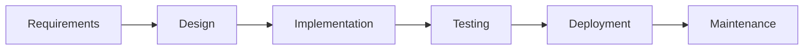
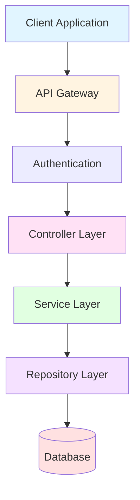
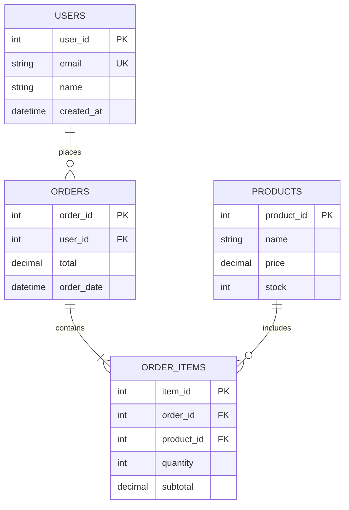
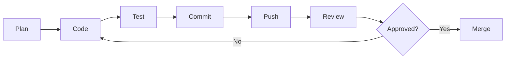

# Jhon Moreno

Software Developer | SENA Student - Software Analysis and Development

Building robust backend systems with clean architecture and scalable database design.

## About Me

I'm a software development student at SENA Colombia, passionate about creating efficient backend solutions and well-structured databases. Currently focusing on enterprise-level architecture patterns and industry best practices.

**Current Status:** Actively developing projects that demonstrate real-world application of software engineering principles.

## Technical Skills

### Programming Languages

### Databases & Tools

### Core Competencies

**Backend Development**
- RESTful API design and implementation
- Business logic layer development
- Error handling and validation
- Authentication and authorization

**Database Management**
- Relational database design
- Data normalization (1NF, 2NF, 3NF)
- Query optimization and indexing
- Transaction management

**Software Architecture**
- Layered architecture pattern
- SOLID principles
- Separation of concerns
- Dependency injection

## Featured Projects

### Academic Portfolio

**Enterprise Backend Systems**
- Implemented layered architecture with clear separation of concerns
- Developed CRUD operations with proper validation
- Applied object-oriented programming principles

**Database Design Projects**
- Normalized database schemas for business scenarios
- Created complex SQL queries with joins and subqueries
- Implemented stored procedures and triggers

**API Development**
- Built RESTful endpoints with proper HTTP methods
- Implemented request/response handling
- Added input validation and error responses

## Architecture Approach

### System Design Philosophy

I follow a structured approach to building software systems:

### Application Architecture

### Layer Responsibilities

**Presentation Layer (Controller)**
- Receives HTTP requests
- Validates input data
- Returns formatted responses
- Handles routing

**Business Logic Layer (Service)**
- Implements business rules
- Coordinates operations
- Manages transactions
- Applies validations

**Data Access Layer (Repository)**
- Executes database queries
- Manages connections
- Handles data mapping
- Optimizes performance

**Database Layer**
- Stores persistent data
- Enforces constraints
- Maintains relationships
- Ensures data integrity

## Database Design Principles

### Normalization Process

**First Normal Form (1NF):** Atomic values, no repeating groups

**Second Normal Form (2NF):** No partial dependencies

**Third Normal Form (3NF):** No transitive dependencies

### Example Schema

## Development Workflow

## GitHub Statistics

## Learning Journey

**Currently Studying:**
- Advanced database optimization techniques
- Design patterns (Singleton, Factory, Strategy)
- Microservices architecture fundamentals
- Unit testing and TDD principles

**Next Goals:**
- Learn Docker containerization
- Explore cloud platforms (AWS/Azure)
- Study message queues (RabbitMQ)
- Master CI/CD pipelines

## SENA Formation

**Program:** Tecnólogo en Análisis y Desarrollo de Software

**Key Learnings:**
- Software development lifecycle
- Agile methodologies (Scrum)
- UML diagramming
- Requirements analysis
- Quality assurance fundamentals

## Code Philosophy

**Clean Code Principles:**
- Meaningful variable and function names
- Single Responsibility Principle
- DRY (Don't Repeat Yourself)
- Proper commenting and documentation
- Consistent code formatting

**Best Practices:**
- Version control with Git
- Code reviews before merging
- Writing reusable components
- Error handling and logging
- Security-first mindset

## Activity & Contributions

**Development Focus:**
- Building portfolio projects showcasing architectural patterns
- Contributing to open-source when possible
- Practicing code refactoring
- Documenting technical decisions

**Collaboration:**
- Open to pair programming sessions
- Willing to review code and provide feedback
- Available for student collaboration projects
- Interested in tech community participation

## Contact & Connect

**Email:** morenopossojhonanderson313@gmail.com

**GitHub:** [@Jhonmoreno000](https://github.com/Jhonmoreno000)

**Location:** Medellín, Colombia

---

### Let's Connect

I'm actively looking for opportunities to collaborate on backend projects, contribute to open-source, and connect with other developers. Feel free to reach out for project collaboration, code reviews, or technical discussions.

**Status:** Available for internships and junior developer positions
