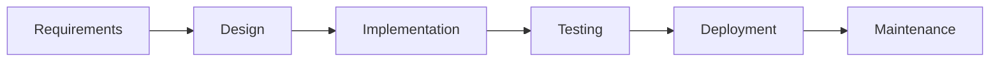
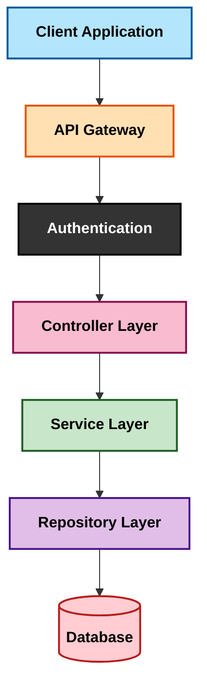
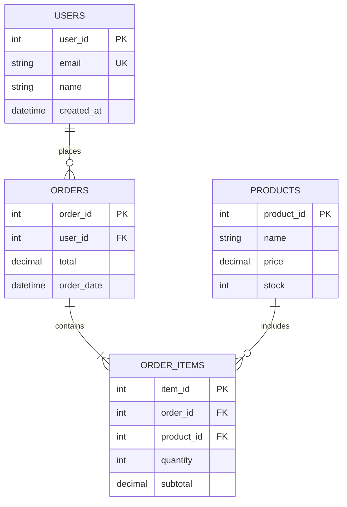
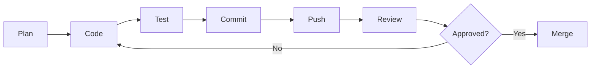

# Jhon Moreno

Software Developer | SENA Student - Software Analysis and Development

Building robust backend systems with clean architecture and scalable database design.

## About Me

I'm a software development student at SENA Colombia, passionate about creating efficient backend solutions and well-structured databases. Currently focusing on enterprise-level architecture patterns and industry best practices.

**Current Status:** Actively developing projects that demonstrate real-world application of software engineering principles.

## Technical Skills

### Programming Languages
<div align="center">


</div>

### Databases & Tools
<div align="center">


</div>

### Methodologies & Concepts
<div align="center">


</div>

### Core Competencies

**Backend Development**
- RESTful API design and implementation
- Business logic layer development
- Error handling and validation
- Authentication and authorization

**Database Management**
- Relational database design
- Data normalization (1NF, 2NF, 3NF)
- Query optimization and indexing
- Transaction management

**Software Architecture**
- Layered architecture pattern
- SOLID principles
- Separation of concerns
- Dependency injection

## Featured Projects

### Academic Portfolio

**Enterprise Backend Systems**
- Implemented layered architecture with clear separation of concerns
- Developed CRUD operations with proper validation
- Applied object-oriented programming principles

**Database Design Projects**
- Normalized database schemas for business scenarios
- Created complex SQL queries with joins and subqueries
- Implemented stored procedures and triggers

**API Development**
- Built RESTful endpoints with proper HTTP methods
- Implemented request/response handling
- Added input validation and error responses

## Architecture Approach

### System Design Philosophy

I follow a structured approach to building software systems:



### Application Architecture



### Layer Responsibilities

**Presentation Layer (Controller)**
- Receives HTTP requests
- Validates input data
- Returns formatted responses
- Handles routing

**Business Logic Layer (Service)**
- Implements business rules
- Coordinates operations
- Manages transactions
- Applies validations

**Data Access Layer (Repository)**
- Executes database queries
- Manages connections
- Handles data mapping
- Optimizes performance

**Database Layer**
- Stores persistent data
- Enforces constraints
- Maintains relationships
- Ensures data integrity

## Database Design Principles

### Normalization Process

**First Normal Form (1NF):** Atomic values, no repeating groups

**Second Normal Form (2NF):** No partial dependencies

**Third Normal Form (3NF):** No transitive dependencies

### Example Schema



## Development Workflow



## GitHub Statistics

<div align="center">
  
  # Hola, soy Jhon Anderson Moreno
  
  [](https://git.io/typing-svg)

  ---

  ### Mis Estadísticas de GitHub
  
  
  
  <br />

  
  

  ---

  ### Herramientas y Tecnologías
  
  
  
  
  

</div>

## Contribution Snake


## Learning Journey

**Currently Studying:**
- Advanced database optimization techniques
- Design patterns (Singleton, Factory, Strategy)
- Microservices architecture fundamentals
- Unit testing and TDD principles

**Next Goals:**
- Learn Docker containerization
- Explore cloud platforms (AWS/Azure)
- Study message queues (RabbitMQ)
- Master CI/CD pipelines

## SENA Formation

**Program:** Tecnólogo en Análisis y Desarrollo de Software

**Key Learnings:**
- Software development lifecycle
- Agile methodologies (Scrum)
- UML diagramming
- Requirements analysis
- Quality assurance fundamentals

## Code Philosophy

**Clean Code Principles:**
- Meaningful variable and function names
- Single Responsibility Principle
- DRY (Don't Repeat Yourself)
- Proper commenting and documentation
- Consistent code formatting

**Best Practices:**
- Version control with Git
- Code reviews before merging
- Writing reusable components
- Error handling and logging
- Security-first mindset

## Activity & Contributions

**Development Focus:**
- Building portfolio projects showcasing architectural patterns
- Contributing to open-source when possible
- Practicing code refactoring
- Documenting technical decisions

**Collaboration:**
- Open to pair programming sessions
- Willing to review code and provide feedback
- Available for student collaboration projects
- Interested in tech community participation

## Contact & Connect

**Email:** morenopossojhonanderson313@gmail.com

**GitHub:** [@Jhonmoreno000](https://github.com/Jhonmoreno000)

**Location:** Medellín, Colombia

---

### Let's Connect

I'm actively looking for opportunities to collaborate on backend projects, contribute to open-source, and connect with other developers. Feel free to reach out for project collaboration, code reviews, or technical discussions.

**Status:** Available for internships and junior developer positions

---

<details>
<summary> Coding Stats</summary>

<br>

<!--START_SECTION:waka-->
<!--END_SECTION:waka-->

**Weekly Development Breakdown**

```text
Java         8 hrs 15 mins   ████████████░░░░░░░░░   45.2%
Python       4 hrs 30 mins   ██████░░░░░░░░░░░░░░░   24.8%
SQL          3 hrs 20 mins   ████░░░░░░░░░░░░░░░░░   18.3%
JavaScript   1 hr 45 mins    ██░░░░░░░░░░░░░░░░░░░    9.6%
Other        25 mins         ░░░░░░░░░░░░░░░░░░░░░    2.1%
```

</details>

<details>
<summary> Current Projects</summary>

<br>

###  In Progress

- **E-commerce Backend API** - RESTful API with JWT authentication
- **Task Management System** - CRUD application with MySQL
- **Database Optimization Study** - Index analysis and query tuning

###  Study Projects

- Implementing design patterns in Java
- Building microservices architecture examples
- Creating technical documentation templates

</details>

<details>
<summary> Fun Facts About Me</summary>

<br>

```javascript
const jhon = {
    location: "Medellín, Colombia",
    education: "SENA - Software Development",
    currentlyLearning: ["Docker", "AWS", "Spring Boot"],
    hobbies: ["Coding", "Tech blogs", "Problem solving"],
    funFact: "I debug with console.log() and I'm not ashamed",
    coffee: " (Required for coding)",
    timezone: "GMT-5"
};
```

</details>

---

<div align="center">

###  Let's Build Something Amazing Together

[](mailto:morenopossojhonanderson313@gmail.com)
[](https://github.com/Jhonmoreno000)
[](https://linkedin.com/in/yourprofile)


</div>
